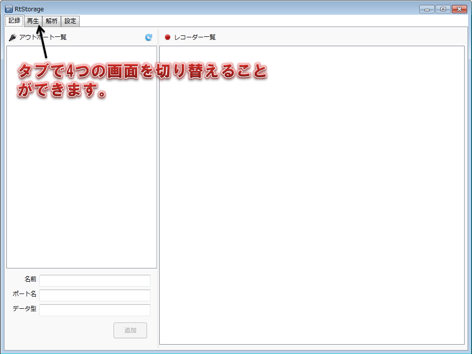
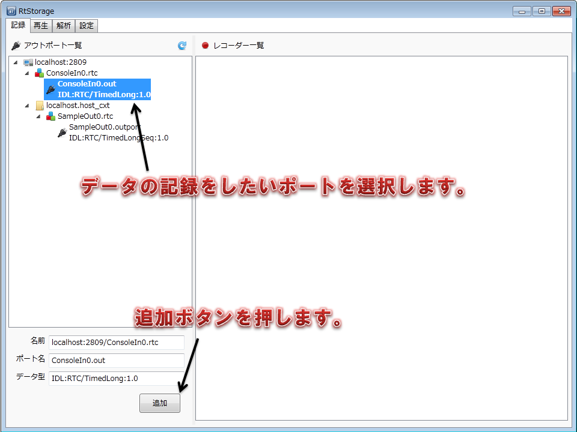

-----------------------
使い方
-----------------------

インストーラでインストールした場合は、Windowsのスタートメニューから、RtStorageを起動してください。

zipファイルを展開した場合は、RtStrage/bin/RtStorage.exeを起動してください。

メイン画面
^^^^^^^^^^^^^^^^^^^^^^^

アプリケーションを起動すると、図のような画面が起動します。
左上のタブで、アプリケーションの4つの画面を切り替えることができます。

設定
^^^^^^^^^^^^^^^^^^^^^^^

まずは設定タブに切り替えて、アプリケーションの設定をしましょう。

図のようにデータ保存ディレクトリを設定します。
データの保存ディレクトリは、RTコンポーネントから出力されたデータを保存するディレクトリです。

設定を反映させるためには、一度アプリケーションを再起動する必要があります。

.. image:: image/DataDirectory.png
   :height: 480
   :width: 640

次にネーミングサービスの設定を行います。

ネーミングサービスの追加ボタンを押し、RTコンポーネントが登録されているネーミングサービスのホスト名とポート番号を設定してください。

.. image:: image/NamingService.png
   :height: 480
   :width: 640

記録
^^^^^^^^^^^^^^^^^^^^^^^

記録画面に切り替えると、ネーミングサービスに登録されているRTコンポーネントのアウトポートの一覧がツリー形式で表示されます。

データを記録したいアウトポートを選択し、左下の追加ボタンを押してください。

追加ボタンを押すと、画面の右側にレコーダーの操作パネルが現れます。
データの記録を開始したいタイミングで、記録ボタンを押してください。

「コンポーネントを活性化する」にチェックを入れておくと、記録ボタンを押したタイミングでコンポーネントが自動的に活性化されます。

.. image:: image/Record.png
   :height: 480
   :width: 640

再生
^^^^^^^^^^^^^^^^^^^^^^^

再生画面に切り替えると、ネーミングサービスに登録されているRTコンポーネントのインポートの一覧がツリー形式で表示されます。

データを再生したいインポートを選択し、左下の追加ボタンを押してください。

.. image:: image/SelectInPort.png
   :height: 480
   :width: 640

追加ボタンを押すと、データの検索画面が表示されます。

検索条件を指定して検索ボタンを押すと、検索結果が表示されるので、再生したいデータを選択してください。

.. image:: image/Search.png
   :height: 480
   :width: 640

データを選択すると、画面の右側にプレイヤーの操作パネルが現れます。
データの再生を開始したいタイミングで、記録ボタンを押してください。

「コンポーネントを活性化する」にチェックを入れておくと、再生ボタンを押したタイミングでコンポーネントが自動的に活性化されます。

「再生を繰り返す」にチェックを入れると、再生が完了したときに最初から再生を繰り返します。

また、スライドバーを操作することで、再生データの再生位置を任意の位置に変更することができます。

.. image:: image/Play.png
   :height: 480
   :width: 640

解析
^^^^^^^^^^^^^^^^^^^^^^^

解析画面に切り替えて、
「データの選択」を押して、解析したいデータを選択してください。

データを選択すると、図のようにデータの各種情報や、再生タイミングの分布グラフが表示されます。

.. image:: image/Analysis.png
   :height: 480
   :width: 640

